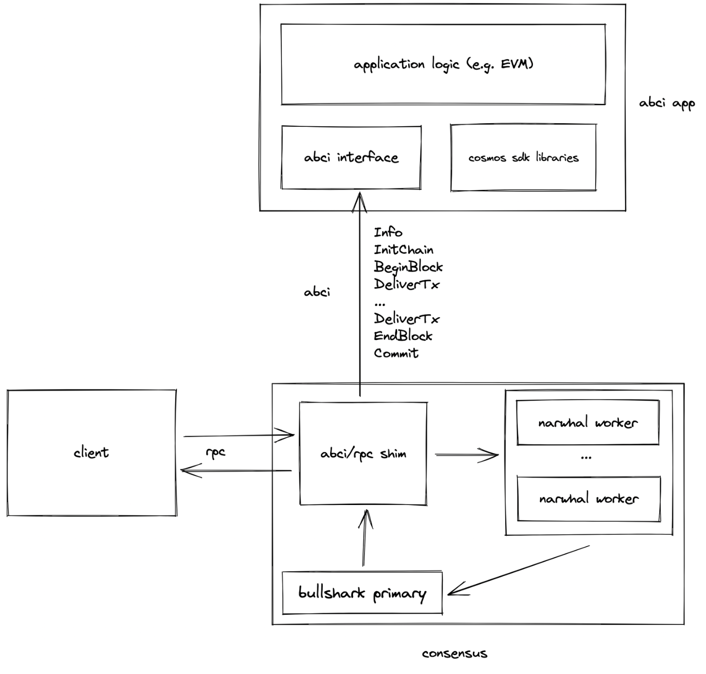

# Narwhal & Bullshark x ABCI x EVM

Components:
* Reliable stream of hashes of batches of transactions from Bullshark
* Reconstruction of the ledger by querying Narwhal workers' stores for the confirmed batches of transactions
* Delivery of the reconstructed ledger over ABCI to the application logic
* Implementation of a Rust ABCI app using REVM

## Demo

Setup/dependencies (from the main folder of the repository):
* [Rust](https://www.rust-lang.org/)
* [Python Poetry](https://python-poetry.org/)
* [tmux](https://github.com/tmux/tmux)
* `cd demo && poetry install`

Run demo (from the main folder of the repository):
1. `cargo run --bin evm-app`
2. 2nd terminal (after the evm-app has started): `cd demo && poetry run fab local`
3. 3rd terminal (after the testbed has started): `cargo run --bin client`

This will spin up a network instance with the EVM app in demo mode (giving Alice 100 ETH) and transfer 1 ETH from Alice to Bob. This uses the underlying Foundry EVM.

## TODOs

1. Why does the state transition take a few seconds to get applied?
2. Can we make this work with Anvil instead of rebuilding a full EVM execution environment?
